# Azure Chat API - Complete Sequence Diagram

This document contains a comprehensive sequence diagram showing how the Azure Chat API works, including tool calling functionality, streaming responses, and all the major components involved.

```mermaid
sequenceDiagram
    participant Client as Frontend Client
    participant Router as Next.js API Route<br/>/api/chat
    participant Entry as ChatAPIEntry
    participant Simplified as ChatAPISimplified
    participant Auth as Authentication
    participant Thread as ChatThreadService
    participant Message as ChatMessageService
    participant Tools as Function Registry
    participant Extensions as Extension Service
    participant OpenAI as Azure OpenAI<br/>v1 Responses API
    participant Stream as OpenAIResponsesStream
    participant Metrics as Metrics Service
    participant DB as Database

    %% Initial Request
    Client->>Router: POST /api/chat<br/>(FormData with content & image)
    Router->>Router: Extract content and multimodal image
    Router->>Entry: ChatAPIEntry(userPrompt, signal)
    
    %% Validation and Entry Point
    Entry->>Entry: Validate multimodal image format
    Entry->>Simplified: ChatAPISimplified(props, signal)
    
    %% Authentication and Thread Management
    Simplified->>Auth: getCurrentUser()
    Auth-->>Simplified: User details
    Simplified->>Thread: EnsureChatThreadOperation(props.id)
    Thread-->>Simplified: Current chat thread
    
    %% Model Configuration and Validation
    Simplified->>Simplified: Get model config and validate deployment
    Simplified->>Simplified: Initialize OpenAI instance
    
    %% Parallel Operations - History and Tools
    par Get Chat History
        Simplified->>Message: FindTopChatMessagesForCurrentUser(threadId)
        Message->>DB: Query chat messages
        DB-->>Message: Historical messages
        Message-->>Simplified: Chat history
    and Get Available Tools
        Simplified->>Tools: getAvailableFunctions()
        Tools-->>Simplified: Built-in functions (createImage, searchDocuments)
        
        opt If Extensions Configured
            Simplified->>Extensions: FindAllExtensionForCurrentUserAndIds()
            Extensions->>DB: Query user extensions
            DB-->>Extensions: Extension configurations
            Extensions-->>Simplified: Extension functions
            loop For each extension function
                Simplified->>Tools: registerDynamicFunction()
                Tools-->>Simplified: Dynamic function registered
            end
        end
    end
    
    %% Save User Message
    Simplified->>Message: CreateChatMessage(user message)
    Message->>DB: Store user message
    DB-->>Message: Message saved
    
    %% Build Request and Conversation Loop
    Simplified->>Simplified: Build input messages for Responses API
    Simplified->>Simplified: Configure request options (model, tools, reasoning)
    
    alt Tools Available (Conversation Loop Approach)
        Note over Simplified: Keep conversation going until no more function calls
        
        loop Until no function calls needed
            Simplified->>OpenAI: responses.create() [non-streaming for conversation management]
            OpenAI-->>Simplified: Response with potential function calls
            
            alt Function Calls Present
                loop For each function call
                    Simplified->>Tools: executeFunction(functionCall, context)
                    
                    alt Built-in Function
                        Tools->>Tools: Execute built-in function<br/>(createImage, searchDocuments)
                        opt Image Generation
                            Tools->>OpenAI: DALL-E image generation
                            OpenAI-->>Tools: Generated image
                            Tools->>Tools: Upload to image store
                        end
                        opt Document Search
                            Tools->>DB: Azure AI Search similarity search
                            DB-->>Tools: Search results with citations
                        end
                        Tools-->>Simplified: Function result
                        
                    else Dynamic Extension Function
                        Tools->>Extensions: Execute extension function
                        Extensions->>Extensions: Build HTTP request with headers
                        Extensions->>External: HTTP call to external API
                        External-->>Extensions: API response
                        Extensions-->>Tools: Extension result
                        Tools-->>Simplified: Function result
                    end
                    
                    Simplified->>Simplified: Add function result to conversation
                end
                Note over Simplified: Continue loop with function results
                
            else No Function Calls
                Note over Simplified: Conversation complete, exit loop
            end
        end
        
        %% Final Streaming Response
        Simplified->>OpenAI: responses.create() [streaming, no tools]
        Note over Simplified: Stream final response after all function calls resolved
        
    else No Tools Available
        Note over Simplified: Direct streaming approach
        Simplified->>OpenAI: responses.create() [streaming]
    end
    
    %% Stream Processing
    OpenAI-->>Stream: Async iterable stream of events
    Simplified->>Stream: OpenAIResponsesStream(stream, chatThread)
    Stream->>Stream: Create ReadableStream
    
    %% Stream Event Processing Loop
    loop For each stream event
        Stream->>Stream: Process event by type
        
        alt Text Delta Events
            Stream->>Stream: response.output_text.delta /<br/>response.text.delta
            Stream->>Client: Stream text content delta
            
        else Reasoning Events
            Stream->>Stream: response.reasoning_summary_text.delta
            Stream->>Client: Stream reasoning content
            
        else Function Call Events (Display Only)
            Stream->>Stream: response.function_call.done /<br/>response.output_item.done
            Note over Stream: Functions already executed in Phase 1,<br/>just stream for display purposes
            Stream->>Client: Stream function call info (display only)
            
        else Image Generation Events
            Stream->>Stream: response.image_generation_call.partial_image
            Stream->>Client: Stream partial image data
            Stream->>Stream: response.image_generation_call.done
            Stream->>Client: Stream complete image
            
        else MCP Events
            Stream->>Stream: response.mcp_approval_request
            Stream->>Client: Stream MCP approval request
            
        else Completion Events
            Stream->>Stream: response.completed / response.done
            Stream->>Message: UpsertChatMessage() - Save final message
            Message->>DB: Store assistant message with reasoning
            
            opt Token Usage Reporting
                Stream->>Metrics: reportCompletionTokens()
                Stream->>Metrics: reportPromptTokens()
                Metrics->>DB: Store usage metrics
            end
            
            Stream->>Client: Send final response and close stream
            
        else Error Events
            Stream->>Stream: error / response.cancelled
            Stream->>Message: Save partial message if available
            Stream->>Client: Stream error response and close
        end
    end
    
    %% Response Headers and Completion
    Simplified->>Metrics: reportUserChatMessage()
    Metrics->>DB: Store user message metrics
    Simplified-->>Router: Response stream with SSE headers
    Router-->>Client: Server-Sent Events stream
    
    %% Client Side Processing
    Note over Client: Client processes SSE events:<br/>- content: Update UI with text deltas<br/>- reasoning: Show reasoning process<br/>- functionCall: Display tool usage<br/>- functionCallResult: Show results<br/>- finalContent: Complete response
```

## Key Components Explained

### 1. **API Entry Point**
- **Route**: `/api/chat` (Next.js API route)
- **Input**: FormData with JSON content + optional multimodal image
- **Validation**: Image format validation for supported types

### 2. **Authentication & Thread Management**
- User authentication through NextAuth
- Chat thread creation/retrieval
- Message history management

### 3. **Model Configuration**
- Dynamic model selection (GPT-4o, o3, gpt-image-1, etc.)
- Reasoning model support with effort levels
- Azure OpenAI v1 Responses API integration

### 4. **Tool/Function System**
- **Built-in Functions**: Image generation (DALL-E), document search (RAG)
- **Dynamic Extensions**: User-configurable external API integrations
- **Function Registry**: Centralized function management and execution

### 5. **Streaming Architecture**
- **Conversation loop for function calls**: Non-streaming during conversation until complete
- **Final response streaming**: Stream only the final response after all function calls resolved  
- **Server-Sent Events**: Continuous client updates for final response

### 6. **Event Types in Stream**
- `content`: Text content deltas
- `reasoning`: Step-by-step reasoning process
- `functionCall`: Tool invocation details
- `functionCallResult`: Tool execution results
- `finalContent`: Complete response
- `error`/`abort`: Error handling

### 7. **Function Calling Workflow**
1. **Conversation Loop**: Continue conversation until no more function calls are needed
2. **Function Detection**: Each turn checks for function calls in the response
3. **Function Execution**: Execute functions and add results to conversation context
4. **LLM Processing**: LLM processes function results and may make additional function calls
5. **Final Response**: When no more functions needed, stream the final response

### 8. **Database Operations**
- Message storage (user + assistant messages)
- Chat thread management
- Usage metrics and analytics
- Extension configurations

### 9. **Error Handling**
- Function execution errors
- Stream processing errors
- Model configuration errors
- Graceful degradation strategies

This architecture supports advanced features like:
- **Multi-turn function calling**
- **Real-time reasoning display**
- **Image generation and editing**
- **RAG (Retrieval Augmented Generation)**
- **Custom API integrations**
- **Token usage tracking**
- **Multimodal input support**
